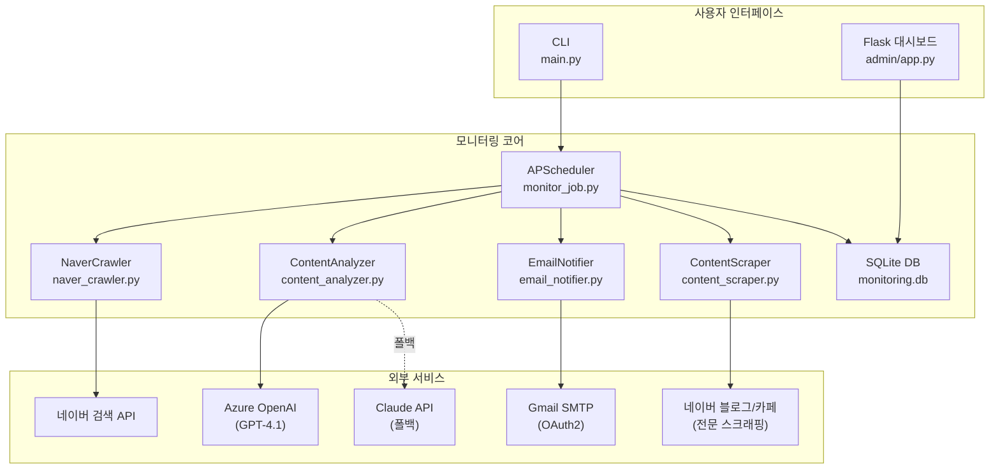
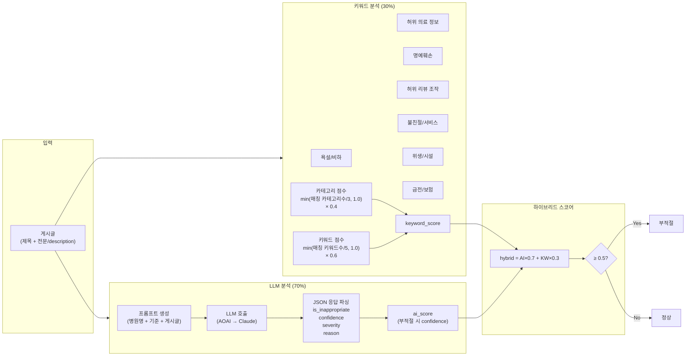
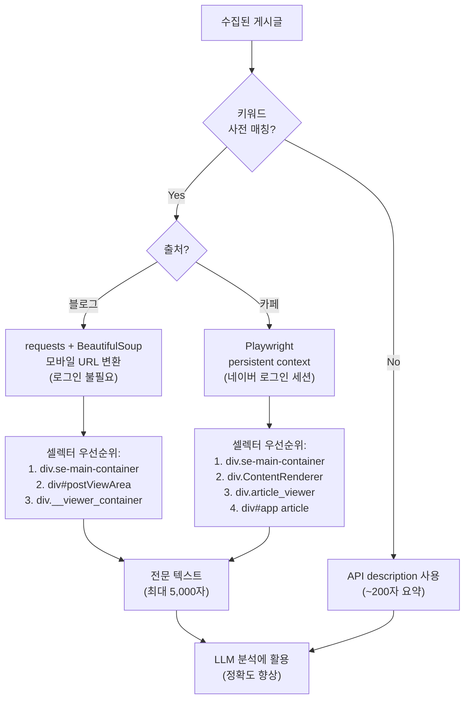
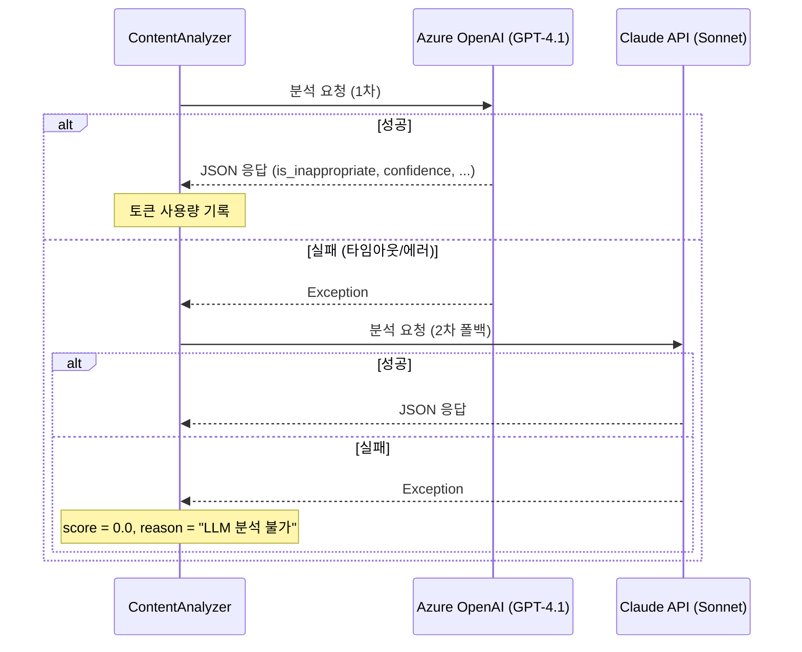
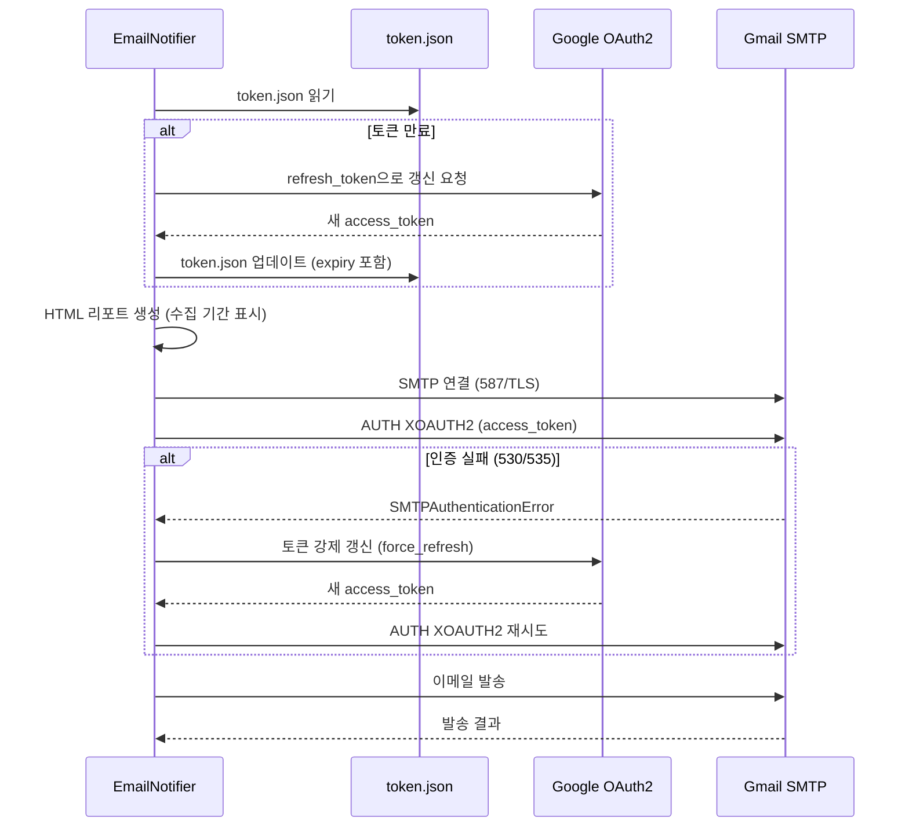

# 조정훈유바외과 네이버 콘텐츠 모니터링 시스템

네이버 블로그/카페에서 병원 관련 게시글을 자동 수집하고, 부적절한 표현을 AI 기반으로 탐지하여 이메일로 알림을 보내는 모니터링 시스템입니다.

## 시스템 아키텍처



## 모니터링 워크플로우

```mermaid
flowchart TD
    START([스케줄러 트리거<br/>월~토 09:00~18:50 매 10분]) --> CRAWL

    subgraph CRAWL_PHASE["1단계: 크롤링 (Search API)"]
        CRAWL[키워드별 네이버 API 호출<br/>정확 매칭 쌍따옴표 적용]
        CRAWL --> BLOG["블로그 검색<br/>(cutoff 기반 페이지네이션 조기 종료)"]
        CRAWL --> CAFE["카페 검색<br/>(known_links 기반 중복 제거)"]
        BLOG --> KW_VALID["키워드 검증 필터<br/>(제목+본문에 키워드 존재 확인)"]
        CAFE --> KW_VALID
        KW_VALID --> MERGE[결과 병합 + 중복 제거]
    end

    MERGE --> DB_CHECK{"DB에<br/>이미 존재?"}
    DB_CHECK -->|Yes| SKIP[건너뜀]
    DB_CHECK -->|No| SAVE_POST["게시글 DB 저장"]
    SAVE_POST --> SCRAPE

    subgraph SCRAPE_PHASE["2단계: 전문 스크래핑 (선택적)"]
        SCRAPE[키워드 매칭 사전 검사]
        SCRAPE -->|키워드 매칭| SCRAPE_BLOG["블로그: requests + BeautifulSoup<br/>(모바일 페이지)"]
        SCRAPE -->|키워드 매칭| SCRAPE_CAFE["카페: Playwright + 로그인 세션<br/>(persistent context)"]
        SCRAPE -->|키워드 미매칭| SKIP_SCRAPE["스크래핑 생략<br/>(description 사용)"]
        SCRAPE_BLOG --> FULL_TEXT["전문 텍스트 확보<br/>(최대 5,000자)"]
        SCRAPE_CAFE --> FULL_TEXT
    end

    FULL_TEXT --> ANALYZE
    SKIP_SCRAPE --> ANALYZE

    subgraph ANALYZE_PHASE["3단계: 분석 (하이브리드 스코어링)"]
        ANALYZE[게시글 분석 시작<br/>전문 또는 description 사용]
        ANALYZE --> KW_FILTER["1차: 키워드 필터링"]
        KW_FILTER -->|매칭 없음| NO_LLM["LLM 호출 생략<br/>(비용 절약)"]
        KW_FILTER -->|매칭 있음| AI_ANALYZE["2차: LLM 문맥 분석<br/>(ThreadPool 5 workers)"]

        AI_ANALYZE --> AOAI_TRY{"AOAI 호출"}
        AOAI_TRY -->|성공| AI_RESULT["AI 판단 결과"]
        AOAI_TRY -->|실패| CLAUDE_TRY{"Claude 폴백"}
        CLAUDE_TRY -->|성공| AI_RESULT
        CLAUDE_TRY -->|실패| NO_AI["AI 분석 불가<br/>(점수 0.0)"]

        AI_RESULT --> HYBRID["하이브리드 스코어<br/>= AI 70% + 키워드 30%"]
        NO_AI --> HYBRID
        NO_LLM --> HYBRID

        HYBRID --> THRESHOLD{"hybrid_score<br/>≥ 0.5?"}
    end

    THRESHOLD -->|No| PASS["정상 판정"]
    THRESHOLD -->|Yes| INAPPROPRIATE["부적절 판정"]

    INAPPROPRIATE --> SEVERITY{"심각도 결정"}
    SEVERITY -->|"≥ 0.8"| HIGH["HIGH"]
    SEVERITY -->|"≥ 0.6"| MEDIUM["MEDIUM"]
    SEVERITY -->|"< 0.6"| LOW["LOW"]

    HIGH --> SAVE_DET["탐지 결과 DB 저장"]
    MEDIUM --> SAVE_DET
    LOW --> SAVE_DET

    SAVE_DET --> NOTIFY

    subgraph NOTIFY_PHASE["4단계: 알림"]
        NOTIFY{"부적절<br/>게시글 있음?"}
        NOTIFY -->|Yes| BUILD_EMAIL["HTML 리포트 생성<br/>(수집 기간 표시)"]
        NOTIFY -->|No| DONE_QUIET["사이클 종료<br/>(알림 없음)"]
        BUILD_EMAIL --> OAUTH["OAuth2 토큰 취득/갱신<br/>(인증 실패 시 강제 갱신 재시도)"]
        OAUTH --> SEND_EMAIL["Gmail XOAUTH2<br/>이메일 발송"]
        SEND_EMAIL --> SAVE_NOTI["알림 이력 DB 저장"]
    end

    SAVE_NOTI --> DONE([사이클 완료])
    DONE_QUIET --> DONE
```



## 콘텐츠 분석 로직 상세



## 전문 스크래핑 전략



## LLM 폴백 전략



## 이메일 발송 흐름



## 프로젝트 구조

```
test/
├── main.py                    # CLI 진입점 (--once, --stats)
├── config.py                  # 전역 설정 (키워드, 카테고리, API 키 등)
├── oauth2_setup.py            # Gmail OAuth2 토큰 발급 스크립트
├── requirements.txt           # Python 의존성
├── .env                       # 환경변수 (API 키, 이메일 설정)
├── monitoring.db              # SQLite DB (자동 생성)
├── pytest.ini                 # 테스트 설정
│
├── crawler/
│   ├── naver_crawler.py       # 네이버 블로그/카페 검색 API 크롤러
│   └── content_scraper.py     # 전문 스크래퍼 (블로그: BS4, 카페: Playwright)
│
├── analyzer/
│   └── content_analyzer.py    # 하이브리드 콘텐츠 분석기 (키워드 + LLM)
│
├── notifier/
│   └── email_notifier.py      # Gmail OAuth2 이메일 알림 발송
│
├── storage/
│   ├── __init__.py            # 저장소 팩토리 (create_storage)
│   ├── base.py                # StorageBackend 추상 클래스
│   └── database.py            # SQLite 저장소 (게시글/탐지/알림 이력)
│
├── scheduler/
│   └── monitor_job.py         # APScheduler cron 기반 주기 실행
│
├── admin/
│   ├── app.py                 # Flask 관리 대시보드
│   └── templates/
│       └── index.html         # 대시보드 UI
│
└── tests/                     # 테스트 (84건)
    ├── test_crawler.py
    ├── test_analyzer.py
    ├── test_database.py
    ├── test_monitor_job.py
    └── test_email_notifier.py
```

## 실행 방법

```bash
# 의존성 설치
pip install -r requirements.txt

# Playwright 브라우저 설치 (카페 전문 스크래핑용)
playwright install chromium

# Gmail OAuth2 토큰 발급 (최초 1회)
python oauth2_setup.py

# 네이버 카페 로그인 세션 설정 (최초 1회, 카페 전문 스크래핑용)
python -m crawler.content_scraper --login

# 1회 실행
python main.py --once

# 스케줄러 모드 (월~토 09:00~18:50 매 10분 + 19:00 일일 리포트)
python main.py

# 누적 통계 확인
python main.py --stats

# 관리 대시보드 실행 (포트 5000)
python admin/app.py
```

## 스케줄링

| 작업 | 일정 | 설명 |
|------|------|------|
| 모니터링 사이클 | 월~토 09:00~18:50 매 10분 | 크롤링→스크래핑→분석→알림 |
| 일일 리포트 | 월~토 19:00 | 전체 누적/금일/이번주 통계 |

macOS launchd로 백그라운드 상시 실행 설정 가능 (`~/Library/LaunchAgents/com.jongsu.hospital-monitor.plist`).

## 환경변수 (.env)

```env
# LLM 설정
LLM_PROVIDER=aoai
AOAI_ENDPOINT=https://your-endpoint.openai.azure.com/
AOAI_API_KEY=your-key
AOAI_DEPLOYMENT=gpt-4.1
AOAI_API_VERSION=2024-12-01-preview
ANTHROPIC_API_KEY=sk-ant-...           # Claude 폴백용

# 네이버 API
NAVER_CLIENT_ID=your-client-id
NAVER_CLIENT_SECRET=your-secret

# 이메일 (OAuth2)
EMAIL_SENDER=your@gmail.com
EMAIL_RECIPIENTS=recipient1@gmail.com,recipient2@gmail.com

# 저장소
STORAGE_BACKEND=sqlite                 # 또는 "azure"
AZURE_STORAGE_CONNECTION_STRING=...    # Azure 사용 시

# 전문 스크래핑
NAVER_SESSION_DIR=.naver_session       # Playwright 세션 저장 경로
```

## 파이프라인 단계별 로그

```
=== 모니터링 사이클 시작 ===
[1/6] known_links 로드: 548건
[2/6] 크롤링 완료: 12건 수집 (키워드 4개, 기간 7일)
[3/6] DB 저장: 신규 5건, 중복 스킵 7건
[4/6] 전문 스크래핑: 대상 2건, 성공 2건, 실패 0건
[5/6] 분석 완료: 전체 5건, 키워드 매칭 → LLM 호출 2건, 부적절 판정 1건
[6/6] 이메일 발송: success (1건 → ['admin@hospital.com'])
=== 사이클 완료 | 신규 5건, 탐지 1건 | 누적 수집: 553건, 누적 탐지: 1건 ===
```

## 부적절 표현 탐지 카테고리 (7종)

| 카테고리 | 설명 | 키워드 예시 |
|----------|------|------------|
| 욕설/비하 | 욕설, 비하 표현 | 쓰레기, 돌팔이, 사기, ㅅㅂ ... |
| 허위 의료 정보 | 검증되지 않은 의료 주장 | 수술 실패, 의료사고, 과잉진료 ... |
| 명예훼손 | 명예훼손성 주장 | 고소당, 폐원, 면허취소, 소송 ... |
| 허위 리뷰 조작 | 리뷰 조작 의심 | 알바, 가짜 리뷰, 별점 조작 ... |
| 불친절/서비스 | 서비스 불만 | 불친절, 무례, 태도 불량 ... |
| 위생/시설 | 위생/시설 문제 | 비위생, 더러, 감염 ... |
| 금전/보험 | 금전/보험 관련 불만 | 바가지, 부당 청구, 환불 거부 ... |
